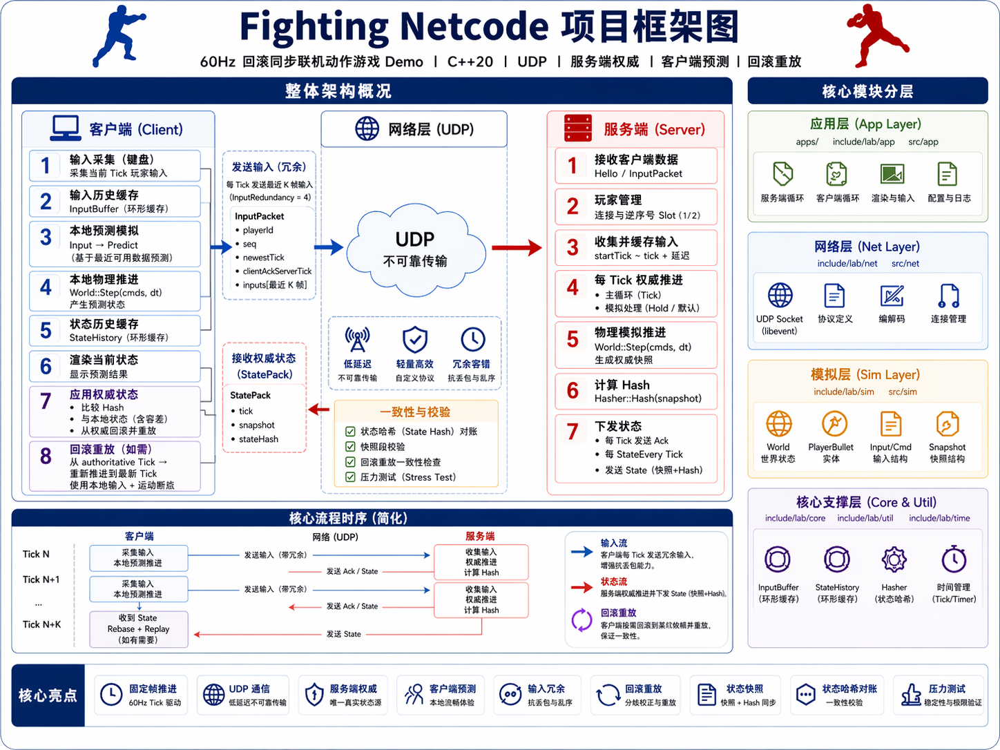

# Fighting Netcode Demo

一个顶视角 60Hz 回滚同步 Demo，用 C++20 实现联机动作游戏最核心的一条链路：固定帧推进、UDP 输入冗余、服务端权威状态、本地预测、权威回滚重放、状态哈希对账和离线压力测试。
## 整体框架和

## 当前能力

- 60Hz 固定 tick 模拟，服务端和客户端都用 accumulator 抵抗系统调度抖动。
- UDP 非阻塞收发，libevent 驱动网络事件和 tick 事件。
- 服务端权威推进，两名客户端收齐后统一 `Start(startTick)` 开局。
- 客户端本地预测，收到权威 `State` 后 rebase 并重放到当前 tick。
- 输入包携带最近 K 帧冗余输入，用于降低 UDP 丢包导致的缺输入风险。
- `WorldSnapshot`、网络 `StatePacket` 和 `Hasher` 使用同一套确定性状态字段。
- `lab_stress` 可离线模拟多玩家、延迟 State、预测偏差和大量回滚校验。

## 快速运行

依赖：

- CMake 3.20+
- C++20 编译器
- libevent
- SDL2
- SDL2_ttf
- nlohmann_json

构建：

```bash
cmake -S . -B build
cmake --build build
```

启动服务端：

```bash
./build/lab_server
```

再开两个终端启动客户端：

```bash
./build/lab_client
./build/lab_client
```

客户端按键：

- `A/D` 或方向键左右：水平移动
- `W/S` 或方向键上下：垂直移动
- `Space/J/K`：发射子弹

运行回归测试：

```bash
ctest --test-dir build --output-on-failure
```

运行压力测试：

```bash
./build/lab_stress
```

拉高压测规模：

```bash
./build/lab_stress --ticks 200000 --history 8192 --state-delay 12 --redundancy 8
```

## 项目流程

```text
Client hello/Input
        |
        v
Server 分配 player slot
        |
        v
收齐 2 个客户端后广播 Start(startTick)
        |
        v
Client 从 startTick 开始本地预测
        |
        v
Client 每 tick 发送冗余 InputPacket
        |
        v
Server 按 tick 取输入，缺输入时 HoldLast 或 Default
        |
        v
Server 推进权威 World::Step
        |
        v
Server 广播 Ack 和周期性 State
        |
        v
Client 校验 State hash，恢复权威快照并重放本地历史
```

## 目录结构

```text
apps/
  server_main.cpp          服务端主循环：握手、权威推进、广播 Ack/State
  client_main.cpp          客户端主循环：输入、预测、回滚、渲染、收包
include/lab/
  app/                     客户端渲染、预测、全局配置
  core/                    离线固定帧 runner
  io/                      录制/回放辅助
  net/                     UDP socket、协议包、二进制编解码
  sim/                     世界状态、输入缓冲、状态历史、确定性 hash
  time/                    steady clock 封装
  util/                    简单日志宏
src/
  app/ net/ sim/ ...       上述模块实现
tests/
  core_tests.cpp           编解码、hash、buffer 等轻量回归测试
  stress_tests.cpp         回滚同步核心链路压力测试
docs/
  ARCHITECTURE.md          架构总览
  PROJECT_DESIGN.md        项目设计与审核说明
  STRESS_TEST_REPORT.md    压力测试报告
```

## 架构拆分

### 模拟层 `lab/sim`

`World::Step(cmds, dt)` 是确定性推进入口。同一 tick、同一组玩家输入和同一份初始快照，应产生同一个 `WorldSnapshot`。

核心数据：

- `InputCmd`：每个 tick 的最小输入单元，包含 `tick/buttons/moveX/moveY`。
- `WorldSnapshot`：网络同步、回滚恢复和 hash 对账共用的世界快照。
- `InputBuffer`：按 tick 取模的输入环形缓冲，读取时校验 tick，避免环覆盖后误读旧输入。
- `StateHistory`：按 tick 保存预测或权威快照，用于回滚和对账。

当前世界逻辑是小型“迷宫坦克”：固定 seed 迷宫、2D 移动、玩家碰撞、直线弹道、命中扣血和短暂 hitstun。

### 网络层 `lab/net`

`UdpSocket` 封装非阻塞 UDP，并注册到 libevent。协议包定义在 `include/lab/net/Packets.h`，二进制编解码在 `src/net/NetCode.cpp`。

主要包类型：

- `Input`：Client 到 Server，携带玩家 id、自增 `seq`、最新 tick、客户端确认的 server tick，以及最近 K 帧输入。
- `Start`：Server 到 Client，分配 `playerId`，告知总玩家数和统一 `startTick`。
- `Ack`：Server 到 Client，告知服务端处理到的 tick、该客户端最新输入 tick，以及权威 hash。
- `State`：Server 到 Client，包含权威 tick、迷宫 seed、玩家状态、弹道状态和 `stateHash`。

### 应用层 `apps` 与 `lab/app`

- `lab_server` 是权威端：分配玩家、收输入、按 60Hz 推进权威世界、广播 `Ack` 和周期性 `State`。
- `lab_client` 是预测端：采样键盘、本地立即推进、发送冗余输入、接收权威状态后回滚重放。
- `GameConfig` 当前运行时配置为 2 名玩家；压力测试脚本支持 1 到 8 名玩家的离线验证。

## 回滚重放

客户端收到权威 `State` 后，会把网络状态还原为 `WorldSnapshot`，校验 hash，然后从该权威快照重放到当前本地 tick：

```text
Restore(authoritativeSnapshot)
for t in authoritativeTick + 1 .. localNextTick - 1:
  local = localHist[t] or default
  remote = predictedRemoteInput[t] or hold/default
  World::Step(allPlayerCmds, dt)
  stateHist.Put(Snapshot())
```

回滚计数只看本地玩家的关键字段：

- 位置误差超过阈值
- HP 不一致
- action 不一致
- onGround 不一致

远端玩家不直接参与回滚触发，因为远端输入本来就是预测值。如果把远端误差也算进去，客户端会因为对手预测偏差而频繁回滚。

## Hash 对账

`Hasher` 对 `WorldSnapshot` 做 FNV 风格混合，用于定位两端状态是否分叉。

实现重点：

- float 字段先按网络状态的毫米精度量化，再进入 hash。
- 玩家、弹道、迷宫 seed、迷宫尺寸和迷宫格子都会进入 hash。
- `shotCooldown` 和 `aimX/aimY` 也属于确定性状态，会进入快照、网络包和 hash。
- `State` 包携带 `stateHash`，客户端收到后可立即校验。
- `Ack` 只在本地已有同 tick 权威快照时才做 hash 对账，避免把预测状态和权威状态直接比较。

## 压力测试

`lab_stress` 是无窗口、无真实 socket 的核心链路压力测试。它在单进程中模拟权威端和客户端，重点压以下路径：

- 长时间推进 `World::Step`。
- 每 tick 编解码带冗余的 `InputPacket`。
- 按固定频率生成权威 `StatePacket`，走完整二进制编解码。
- 给 State 人为加入延迟和轻微抖动。
- 客户端使用故意不准的远端预测输入。
- 延迟 State 到达后从权威快照回滚，并用真实输入历史重放到当前 tick。
- 用原始快照校验 `Restore + Replay` 能追上权威端原始轨迹。
- 用网络量化快照校验客户端和同一起点重放结果 hash 一致。

常用参数：

- `--ticks N`：模拟 tick 数，默认 `60000`。
- `--players N`：模拟玩家数，默认 `2`，范围 `1..8`。
- `--history N`：输入/状态环形缓冲容量，默认 `4096`。
- `--state-every N`：每 N tick 生成一次权威 State，默认 `2`。
- `--state-delay N`：State 延迟 N tick 后送达客户端，默认 `7`。
- `--redundancy N`：每个 Input 包携带的历史输入帧数，默认 `8`。

CTest 结果：`lab_tests` 和 `lab_stress_smoke` 全部通过，2/2 Passed，总耗时 3.07s。

手动压力测试结果：

| 场景 | ticks | 玩家 | 输入包 | 状态包 | 网络字节 | 回滚次数 | 重放 tick | 哈希校验 | 耗时 | TPS |
| --- | ---: | ---: | ---: | ---: | ---: | ---: | ---: | ---: | ---: | ---: |
| 基准长跑 | 60,000 | 2 | 120,000 | 30,000 | 13,254,234 | 29,996 | 239,967 | 29,996 | 23.7665s | 2,524.56 |
| 中等负载 | 120,000 | 4 | 480,000 | 60,000 | 66,279,588 | 59,995 | 599,949 | 59,995 | 78.3031s | 1,532.51 |
| 极限负载 | 180,000 | 8 | 1,440,000 | 180,000 | 264,534,066 | 179,987 | 2,399,825 | 179,987 | 393.098s | 457.901 |

三组压力测试全部以 `stress OK` 结束，没有出现解码失败、哈希不一致、历史缺失或 raw restore/replay mismatch。结果说明当前核心链路的确定性同步和回滚重放稳定性较好。TPS 在 8 玩家、每 tick 状态包的极限场景下降明显，后续性能优化应优先看 `ReplayFrom` 回滚路径和高频状态校验成本。

## 代码审核结论

整体判断：核心同步闭环已经跑通，离线压力测试结果可靠，当前风险主要集中在工程化、配置一致性和真实网络场景覆盖，而不是确定性同步本身。

### 做得好的地方

- 模拟、网络、应用三层拆分清楚，`lab_core` 不包含 main，测试可以直接复用核心逻辑。
- `InputBuffer` 和 `StateHistory` 都做了 tick 校验，环形覆盖后不会误读旧槽位。
- 网络包解码按字段逐项读取并检查长度，短包不会越界读。
- hash 使用网络量化精度，避免 raw float 字节造成跨端误判。
- 压力测试覆盖了预测偏差、延迟 State、回滚重放、编解码和 hash 校验，测试价值高。

### 需要注意的边界

- 运行时服务端和客户端当前固定为 2 玩家，离线压测支持到 8 玩家，两者不是同一个能力边界。
- `CMakeLists.txt` 在配置阶段总是要求 SDL2/SDL2_ttf，即使只想构建 server 或测试，也需要安装客户端图形依赖。
- 客户端的 server IP、port、窗口标题和字体路径还是硬编码，跨机器运行前需要改代码或增加命令行参数。
- `UdpAddr::FromIPv4` 和 `Bind` 没有检查 `inet_pton` 返回值，非法 IP 会更难排查。
- 当前测试主要压核心逻辑，不压真实 UDP 丢包、乱序、连接 churn、窗口渲染和多进程 bot 客户端。
- 仓库里存在多个本机构建目录，建议只保留源码和文档，并把 `build-*/` 加入忽略规则。

## 常见排查

客户端一直等不到开始：

- 确认服务端已启动。
- 需要启动两个客户端，因为当前运行时 `kRequiredPlayers = 2`。
- 检查端口 `40000` 是否被占用。

hash mismatch 增多：

- 确认所有会影响 `World::Step` 结果的字段都在 `WorldSnapshot`、网络包和 `Hasher` 中。
- 避免在模拟层使用真实时间、随机数或未同步状态。
- 新增 float 字段时，优先按网络精度量化后再 hash。

频繁 rollback：

- 先看本地玩家位置、HP、action 是否频繁偏离。
- 检查服务端缺输入策略，确认输入冗余 `kInputRedundancy` 是否足够。
- 远端玩家误差不要直接作为回滚触发条件。

客户端窗口或字体异常：

- SDL2 / SDL2_ttf 需要正确安装。
- macOS 当前默认字体路径是 `/System/Library/Fonts/Menlo.ttc`。

## 后续优化方向

- 给 `lab_client` 和 `lab_server` 增加命令行参数：server ip、port、玩家数、窗口标题、字体路径。
- 拆分 CMake 选项，让 `LAB_BUILD_CLIENT`、`LAB_BUILD_SERVER`、`LAB_BUILD_TESTS` 可以独立打开，测试构建不强依赖 SDL。
- 增加网络统计：RTT、丢包估计、input lead、state delay、rollback cost。
- 引入真实网络集成测试：启动 server 和两个 headless/bot client，跑固定 tick 后校验 hash。
- 给协议包增加集中 schema 或字段表，降低手写编解码漏字段风险。
- 对高压场景做 profiling，优先分析回滚重放、状态构造、hash 和快照复制成本。
