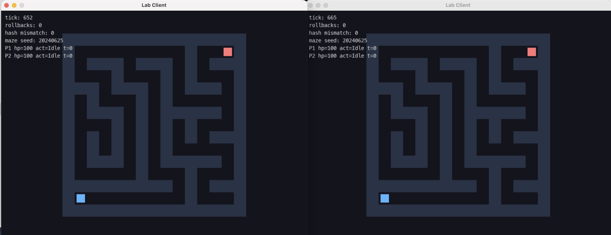

# Fighting Netcode Demo

一个用 C++20 实现的实时动作游戏网络同步 Demo。项目聚焦 **server authoritative + client prediction + rollback/replay** 这一条核心链路，目标不是做完整商业游戏，而是把联机动作游戏里最关键、最容易出错的同步机制做成一个可运行、可测试、可复盘的最小系统。



## 项目简介

这个 Demo 是一个顶视角 60Hz 迷宫对战原型：两个客户端连接同一个 UDP 服务端，玩家可以移动、发射弹道、碰撞、扣血，并在客户端本地预测和服务端权威状态之间保持同步。

项目重点展示：

- 固定帧推进：所有模拟逻辑以 60Hz tick 运行，避免渲染帧率和系统调度影响游戏结果。
- UDP 输入冗余：客户端每包携带最近 K 帧输入，降低丢包导致的缺输入风险。
- 服务端权威：服务端统一推进世界状态，并周期性广播权威 `State`。
- 客户端预测：客户端先本地响应输入，收到权威状态后再校正。
- 回滚重放：从权威快照恢复，并重放本地输入历史追到当前 tick。
- 状态哈希：用网络量化后的状态 hash 检测两端是否分叉。
- 压力测试：离线模拟延迟、预测错误、多玩家和大量回滚，验证核心同步链路。

## 技术栈

- C++20 / CMake
- UDP / non-blocking socket / libevent
- SDL2 / SDL2_ttf
- CTest
- 手写二进制协议编解码
- rollback netcode / deterministic state hash

## 快速运行

依赖：

- CMake 3.20+
- C++20 编译器
- libevent
- SDL2
- SDL2_ttf
- nlohmann_json

构建：

```bash
cmake -S . -B build
cmake --build build
```

启动服务端：

```bash
./build/lab_server
```

再开两个终端启动客户端：

```bash
./build/lab_client
./build/lab_client
```

客户端按键：

- `A/D` 或方向键左右：水平移动
- `W/S` 或方向键上下：垂直移动
- `Space/J/K`：发射子弹

运行测试：

```bash
ctest --test-dir build --output-on-failure
./build/lab_stress
```

## 项目流程

```text
Client hello/Input
        |
        v
Server 分配 player slot
        |
        v
收齐 2 个客户端后广播 Start(startTick)
        |
        v
Client 从 startTick 开始本地预测
        |
        v
Client 每 tick 发送冗余 InputPacket
        |
        v
Server 按 tick 取输入，缺输入时 HoldLast 或 Default
        |
        v
Server 推进权威 World::Step
        |
        v
Server 广播 Ack 和周期性 State
        |
        v
Client 校验 State hash，恢复权威快照并重放本地历史
```

## 架构概览


项目按三层拆分：

| 层 | 目录 | 职责 |
| --- | --- | --- |
| 模拟层 | `include/lab/sim`、`src/sim` | `World::Step`、输入缓冲、状态快照、回滚历史、确定性 hash |
| 网络层 | `include/lab/net`、`src/net` | UDP socket、协议包定义、二进制编解码 |
| 应用层 | `apps`、`include/lab/app`、`src/app` | 服务端主循环、客户端预测/回滚、SDL 渲染 |

核心可执行目标：

- `lab_server`：服务端权威推进，接收输入并广播 `Ack/State`。
- `lab_client`：客户端本地预测、发送冗余输入、接收权威状态并回滚重放。
- `lab_tests`：轻量回归测试，覆盖 codec、hash、buffer 等基础行为。
- `lab_stress`：离线压力测试，覆盖预测偏差、延迟 State 和大量回滚校验。

## 网络协议

协议定义在 `include/lab/net/Packets.h`，编解码实现在 `src/net/NetCode.cpp`。所有包都带 `magic/version/type`，解码时逐字段检查长度。

| 包 | 方向 | 内容 |
| --- | --- | --- |
| `Input` | Client -> Server | player id、seq、最新 tick、客户端确认的 server tick、最近 K 帧输入 |
| `Start` | Server -> Client | 分配的 player id、总玩家数、统一 start tick |
| `Ack` | Server -> Client | 服务端处理到的 tick、该客户端最新输入 tick、权威 hash |
| `State` | Server -> Client | 权威 tick、迷宫 seed、玩家状态、弹道状态、state hash |

## 回滚同步

客户端收到权威 `State` 后，会把网络包还原成 `WorldSnapshot`，校验 `stateHash`，然后从该权威快照恢复并重放输入历史：

```text
Restore(authoritativeSnapshot)
for t in authoritativeTick + 1 .. localNextTick - 1:
  local = localHist[t] or default
  remote = predictedRemoteInput[t] or hold/default
  World::Step(allPlayerCmds, dt)
  stateHist.Put(Snapshot())
```

回滚触发主要观察本地玩家的位置、HP、action 和 onGround。远端玩家输入本来就是预测值，如果直接把远端误差作为 rollback 触发条件，客户端会因为对手预测偏差而频繁回滚。

## 压力测试结果

完整报告见 [docs/STRESS_TEST_REPORT.md](docs/STRESS_TEST_REPORT.md)。

本次压力测试覆盖：

- 输入包和状态包的二进制编解码。
- 权威快照到网络量化快照的 hash 校验。
- 延迟 State 到达后的 rollback/replay。
- 远端预测故意出错后的状态收敛。
- raw restore/replay 与权威历史的一致性。

CTest 结果：`lab_tests` 和 `lab_stress_smoke` 全部通过，2/2 Passed，总耗时 3.07s。

手动压力测试结果：

| 场景 | ticks | 玩家 | 输入包 | 状态包 | 网络字节 | 回滚次数 | 重放 tick | 哈希校验 | 耗时 | TPS |
| --- | ---: | ---: | ---: | ---: | ---: | ---: | ---: | ---: | ---: | ---: |
| 基准长跑 | 60,000 | 2 | 120,000 | 30,000 | 13,254,234 | 29,996 | 239,967 | 29,996 | 23.7665s | 2,524.56 |
| 中等负载 | 120,000 | 4 | 480,000 | 60,000 | 66,279,588 | 59,995 | 599,949 | 59,995 | 78.3031s | 1,532.51 |
| 极限负载 | 180,000 | 8 | 1,440,000 | 180,000 | 264,534,066 | 179,987 | 2,399,825 | 179,987 | 393.098s | 457.901 |

三组压力测试全部以 `stress OK` 结束，没有出现解码失败、哈希不一致、历史缺失或 raw restore/replay mismatch。结果说明当前核心链路的确定性同步和回滚重放稳定性较好。

## 目录结构

```text
apps/
  server_main.cpp          服务端主循环：握手、权威推进、广播 Ack/State
  client_main.cpp          客户端主循环：输入、预测、回滚、渲染、收包
include/lab/
  app/                     客户端渲染、预测、全局配置
  core/                    离线固定帧 runner
  io/                      录制/回放辅助
  net/                     UDP socket、协议包、二进制编解码
  sim/                     世界状态、输入缓冲、状态历史、确定性 hash
  time/                    steady clock 封装
  util/                    简单日志宏
src/
  app/ net/ sim/ ...       上述模块实现
tests/
  core_tests.cpp           编解码、hash、buffer 等轻量回归测试
  stress_tests.cpp         回滚同步核心链路压力测试
docs/
  ARCHITECTURE.md          架构总览
  PROJECT_DESIGN.md        项目设计与审核说明
  STRESS_TEST_REPORT.md    压力测试报告
  项目界面.png             启动后的客户端渲染截图
  权威服务器.png           权威同步流程图
```

## 项目边界

当前版本主要验证核心同步机制，仍有几个明确边界：

- 运行时服务端和客户端当前固定为 2 玩家；离线压测支持 1 到 8 玩家。
- 压力测试主要压核心逻辑，不压真实 UDP 丢包、乱序、连接 churn、窗口渲染和多进程 bot 客户端。
- 客户端的 server IP、port、窗口标题和字体路径仍是硬编码。
- CMake 配置阶段目前会要求 SDL2/SDL2_ttf，即使只构建服务端或测试。

## 后续方向

- 给 `lab_client` 和 `lab_server` 增加命令行参数：server ip、port、玩家数、窗口标题、字体路径。
- 拆分 CMake 选项，让 server、client、tests 可以独立构建。
- 增加网络统计：RTT、丢包估计、input lead、state delay、rollback cost。
- 增加真实网络集成测试：启动 server 和两个 headless/bot client，跑固定 tick 后校验 hash。
- 对高压场景做 profiling，优先分析回滚重放、状态构造、hash 和快照复制成本。

## 相关文档

- [架构总览](docs/ARCHITECTURE.md)
- [项目设计与审核说明](docs/PROJECT_DESIGN.md)
- [压力测试报告](docs/STRESS_TEST_REPORT.md)
- [开发过程记录](日志.md)
