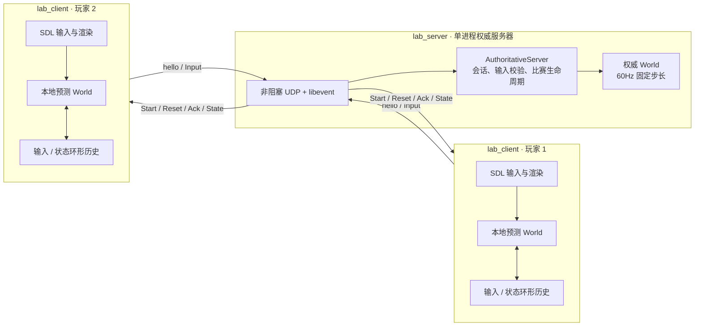

# 把一次联机对战摊开来看：Fighting Netcode Demo 的架构与实现

动作游戏的联网难点，不是把坐标从一台机器发到另一台机器，而是在延迟、丢包和乱序都存在时，同时满足两件看似矛盾的事：玩家按键后必须立刻看到反馈，所有客户端最终又必须服从同一份比赛结果。

Fighting Netcode Demo 是一个用 C++20 实现的 60Hz 顶视角迷宫对战原型。两个客户端可以移动、发射弹道、碰撞和扣血；客户端先在本地预测，服务端独立推进权威世界，客户端收到权威快照后再恢复并重放尚未确认的输入。项目刻意停在“最小但完整”的同步闭环：它不是一款完整游戏，也没有房间平台、账号系统或持久化服务，重点是让 server authoritative、client prediction 与 rollback/replay 这条最容易出错的链路可以运行、观察和验证。

## 系统边界：只有客户端、UDP 和权威服务器


```mermaid
flowchart LR
    subgraph C1[lab_client · 玩家 1]
        I1[SDL 输入与渲染]
        P1[本地预测 World]
        H1[输入 / 状态环形历史]
        I1 --> P1
        P1 <--> H1
    end

    subgraph S[lab_server · 单进程权威服务器]
        U[非阻塞 UDP + libevent]
        A[AuthoritativeServer<br/>会话、输入校验、比赛生命周期]
        W[权威 World<br/>60Hz 固定步长]
        U --> A --> W
    end

    subgraph C2[lab_client · 玩家 2]
        I2[SDL 输入与渲染]
        P2[本地预测 World]
        H2[输入 / 状态环形历史]
        I2 --> P2
        P2 <--> H2
    end

    C1 -- hello / Input --> U
    U -- Start / Reset / Ack / State --> C1
    C2 -- hello / Input --> U
    U -- Start / Reset / Ack / State --> C2
```

浏览器并不参与这个项目；客户端首先、也是直接访问 `lab_server` 的 UDP 40000 端口。这里没有 Gateway 或独立 API 服务，`apps/server_main.cpp` 只负责把 socket 事件和 60Hz 定时事件适配给 `AuthoritativeServer`，后者处理连接身份、输入窗口、玩家超时和比赛推进。

服务端内存中的 `World` 是比赛状态的唯一 source of truth。仓库没有数据库、Redis、消息队列、缓存、向量库或模型服务，因此也不存在可重建的向量索引或模型调用链。玩家、弹道和迷宫会进入 `WorldSnapshot` 并随权威状态同步，但进程退出后不会持久化。客户端的输入历史、预测快照、网络统计和服务端的连接表同样只是有界的运行时状态；`RecordReplay` 目前也只是内存辅助类，并未形成落盘回放系统。

## 三个关键取舍

### 客户端负责“快”，服务端负责“对”

如果客户端每次按键都等待网络往返，操作手感会直接受 RTT 支配；如果完全相信客户端，比赛结果又没有统一裁决者。这里的做法是让两端复用同一个 `World::Step`：客户端采样输入后立即推进预测世界，服务端收到输入后推进独立的权威世界。预测错误可以修正，权威状态不能被客户端覆盖。

### UDP 不保证送达，输入包自己携带冗余

项目没有在 UDP 上复制一套可靠传输协议。客户端每个 tick 发送一个 `InputPacket`，包内带最近 4 帧本地输入；丢掉一个包时，后续包仍可能补回缺失帧。服务端按 tick 从环形缓冲取命令，短暂缺失时最多保持上次输入 6 帧，再退回默认空输入。这个选择用少量重复字节换取简单、低等待的输入通道。

`sessionId + matchId + playerId` 则限定了每个包属于谁、属于哪一局。服务端还会检查 tick 窗口、命令数量、方向范围、按钮掩码和包速率，避免陈旧、超前或畸形输入进入模拟。

### 确定性不是“float 完全相等”，而是共享量化口径

服务端通过 `State` 下发玩家与弹道状态，并附带 `stateHash`。网络状态以毫米整数表示，客户端还原后使用与网络包相同的量化规则计算哈希。这样比较的是双方真正交换的状态，而不是服务端原始浮点数与客户端解码浮点数，减少无意义的假分叉。

## 一次真实对局如何流过系统

1. 客户端尚未入局时，每 250ms 发送一个空 `Input` 作为 hello。服务端按来源地址分配 slot；两名玩家到齐后生成递增的 `matchId`、会话身份和权威迷宫，通过 `Start` 发给双方。`Start` 丢失时，后续 hello 会触发重发。
2. 客户端从统一的 `startTick` 开始。每个 1/60 秒采样一次键盘，把命令写入 `localHist`，预测另一名玩家的输入，然后调用 `World::Step` 立即更新画面。
3. 同一 tick 的本地输入连同最近几帧历史编码为 `InputPacket`，通过 UDP 发往服务端。客户端不会把自己预测出的世界当成权威状态上传。
4. 服务端的 libevent 循环接收数据报并校验身份与输入；固定步长 accumulator 每次只推进一个确定的 tick。每帧向各客户端发送 `Ack`，每 2 帧发送一次 `State`。
5. 客户端用 `Ack` 更新已处理 tick、RTT 与输入丢包估计；收到新的 `State` 后先验证身份和哈希，再把网络状态还原为权威 `WorldSnapshot`。
6. 客户端从权威 tick 恢复世界，并重放该 tick 之后保存在本地的输入，追到当前预测 tick。只有本地玩家的位置、HP、动作或落地状态超过阈值时才计为一次有感回滚，但每个有效的新快照都会执行 rebase + replay，让远端玩家和弹道及时回到权威轨道。
7. 某个玩家 10 秒没有活动时，服务端结束当前比赛并向剩余玩家发送 `Reset`；新玩家补位后以新的 `matchId` 开局。

回滚的核心并不复杂，关键在于恢复点和重放区间必须一致：

```text
Restore(authoritativeSnapshot)
for tick in authoritativeTick + 1 .. localNextTick - 1:
    local  = localHistory[tick]  or default
    remote = predictedRemote[tick] or hold/default
    World::Step(allPlayerInputs, 1/60s)
    stateHistory.Put(World::Snapshot())
```

## 当前界面：预测、权威校正与指标在同一窗口里


SDL2 客户端渲染迷宫、玩家和弹道，HUD 同时展示 `tick`、回滚次数、哈希不一致次数、RTT、丢包估计、input lead、state delay、replay ticks 与 replay cost。它不是装饰层：这些指标把“画面偶尔抖了一下”拆成网络延迟、权威状态陈旧程度和回滚执行成本，便于定位同步问题。

## 异步、流式状态与可观测性

这个系统没有 Web 意义上的同步请求，也没有后台 Worker 或异步任务队列。网络收发由非阻塞 UDP 回调驱动，模拟由 libevent 定时器驱动；二者在同一服务端进程内汇合到 `AuthoritativeServer`。因此，所谓“异步任务”实际是网络数据报到达与固定 tick 调度之间的协调，而不是可持久化、可重试的 job。

状态传输也不是 TCP/WebSocket 字节流，而是一系列彼此独立的 UDP 数据报：

- `Ack` 每 tick 返回服务端进度、权威哈希和输入包统计，适合确认与观测。
- `State` 每 2 tick 返回可独立解码的权威快照；旧快照可以直接丢弃，不要求按顺序补齐。
- `Start` 和 `Reset` 没有可靠通道兜底，而是利用客户端持续 hello 或旧场次输入触发服务端重发。

可观测性全部留在进程内或标准输出：客户端 HUD/`STAT` 日志展示 RTT、上行丢包估计、领先 tick、状态延迟和重放成本；服务端日志展示权威 tick、位置与哈希；`lab_stress` 和 `lab_performance` 汇总吞吐、分位耗时与一致性检查。项目没有 Prometheus、Grafana 或外部 APM，这也是当前明确边界。

## 当回滚被放大十万次，系统还能不能回到同一个世界

这个项目最值得展示的不是“跑得快”，而是它把联机同步里最难证明的事情变成了可重复验证的结果：客户端可以不断猜错、恢复、重放，最后仍然和权威服务器得到同一个状态。

在最重的离线场景里，测试把规模提高到 8 名玩家和 180,000 个 tick，让服务端每个 tick 都生成一份 State。整个过程处理了 **1,440,000 个输入包、约 252MiB 编码数据和 179,987 次回滚校验**。最终没有出现一次解码失败、哈希不一致、历史缺失或 raw restore/replay mismatch。运行时客户端目前仍然只支持两名玩家；这里的 8 玩家不是功能宣称，而是故意把同一套确定性模拟和回滚路径压到更重的负载下。

另一组 2 玩家测试更接近日常对局：State 每 2 tick 下发、固定延迟 7 tick，60,000 tick 内累计重放 239,967 帧。**29,996 次网络量化后的哈希校验和 29,996 次原始快照恢复校验全部通过**，restore/replay 的 P99 为 0.0017ms。这组数字说明，量化、编码、恢复和重放不是各自“看起来正确”，而是在同一条数据链上形成了闭环。

### 单线程究竟能推进多少个权威世界

确定性成立之后，下一个问题才是 60Hz deadline。2026-07-13 的 Release 基线在 10 核 Apple Silicon、16GB 内存机器上运行，但容量测试刻意只使用单线程批量推进 `AuthoritativeServer`。验收要求连续三轮同时满足 tick P99 ≤ 16.67ms、deadline miss ≤ 0.1%，并且协议和哈希错误为 0。

在这个口径下，核心模拟达到 **7,208 个房间、14,416 名玩家**的最大稳定档；三轮 P99 中位数为 10.405ms，最差 10.983ms。按照 80% 留出余量，报告给出的建议安全值是 **5,766 个房间、11,532 名玩家**。这不是只报一个最好看的峰值：继续加到 12,288 个房间后，P99 中位数升至 17.734ms，deadline miss 最差达到 23.2%，测试明确判定失败。

这个失败点同样重要。它说明容量边界能够被测试准确暴露，而不是靠平均耗时掩盖尖峰；当前首先撞到的是单线程 CPU 的 16.67ms 实时预算。按实测约 128KiB/房间估算，内存边界远在 CPU 之后，因此后续优化可以直接聚焦高频 tick、状态构造和回滚路径。

### 网络侧没有被 benchmark 绕开

容量测试之外，项目还用真实 loopback UDP 跑完整握手、输入和 ACK 链路。正常的 60 PPS/客户端场景成功率为 **100%**，ACK RTT P99 为 36.328ms；提高到 120 PPS/客户端仍保持 100%。当输入继续升到 480 PPS/客户端时，服务端的 240 PPS/客户端限流开始生效，但权威 tick 仍维持 60Hz，协议、身份和哈希错误仍为 0。

这些结果共同构成了项目的亮点：确定性不是靠理想输入证明的，实时容量不是用平均值推算的，UDP 链路也不是用内存函数调用代替的。同时要保留边界意识——7,208 个房间代表当前服务端核心的单线程推进能力，不包含尚未实现的多房间 UDP 路由、额外系统调用、跨房间调度和公网开销，不能直接当作线上单机承载量。

完整测试环境、逐档容量曲线、P50/P95/P99/P99.9 和原始 JSON 数据见 [完整性能报告](docs/PERFORMANCE_REPORT.md)、[压力测试报告](docs/STRESS_TEST_REPORT.md) 与 [原始性能结果](docs/performance_results.json)。

## 最短可运行路径

需要 CMake 3.20+、支持 C++20 的编译器、libevent、SDL2 和 SDL2_ttf。macOS 客户端当前使用系统 Menlo 字体路径。仓库沿用 CMake，不需要额外脚本或新的包管理器。

```bash
cmake -S . -B build
cmake --build build
```

先启动权威服务器：

```bash
./build/lab_server
```

再在两个终端分别启动客户端：

```bash
./build/lab_client
```

使用 `W/A/S/D` 或方向键移动，使用 `Space`、`J` 或 `K` 发射弹道。服务端地址与端口目前固定为 `127.0.0.1:40000`。

## 代码如何分层

```text
apps/
  server_main.cpp            UDP/libevent 适配与服务端主循环
  client_main.cpp            输入、预测、收包、回滚与 SDL 应用循环
include/lab/ + src/
  sim/                       World、快照、输入/状态历史、确定性哈希
  net/                       UDP socket、v5 包结构与二进制编解码
  server/                    可被生产入口和集成测试复用的权威服务器
  app/                       客户端输入预测、渲染与共享游戏常量
  core/                      离线固定步长 runner
  io/                        内存录制/回放辅助
  time/                      steady clock 封装
tests/
  core_tests.cpp             编解码、哈希、环形缓冲等基础回归
  stress_tests.cpp           延迟 State、预测偏差与大量重放
  network_integration_tests.cpp
                              真实 loopback UDP + 两个 headless bot
  performance/               实时容量与分位耗时测试
```

分层的中心是纯数据 `WorldSnapshot` 和唯一推进入口 `World::Step`。网络层负责把快照量化、编码和还原；服务端与客户端负责决定何时推进、何时恢复；测试可以绕过 SDL 和人工操作，直接复用相同的世界与服务端实现。

## 常用协议与验证方法

协议只有五种包，定义在 `include/lab/net/Packets.h`，编解码位于 `src/net/NetCode.cpp`：`Input` 从客户端携带冗余输入，`Start` 建立比赛身份并下发迷宫，`Ack` 确认服务端进度，`State` 携带权威快照，`Reset` 使客户端回到等待状态。所有包都以 `magic + version + type` 开头，解码时逐字段检查长度。

最小回归验证不会运行完整性能套件：

```bash
ctest --test-dir build \
  -R '^(lab_tests|lab_stress_smoke|lab_network_integration)$' \
  --output-on-failure --timeout 120
```

其中 `lab_network_integration` 使用真实 loopback UDP 启动一个权威服务端和两个无界面 bot，验证丢失 `Start` 后的恢复、输入校验、`Ack/State` 身份以及最终权威哈希。需要单独观察回滚链路时，可以运行一个有界的离线压力样例：

```bash
./build/lab_stress --ticks 3000 --history 512 --state-delay 5
```

更完整的指标口径与历史结果分别见 [性能指标说明](docs/PERFORMANCE_METRICS.md)、[性能报告](docs/PERFORMANCE_REPORT.md) 和 [压力测试报告](docs/STRESS_TEST_REPORT.md)。

## 当前限制与开放问题

- 运行时固定为 2 名玩家；离线压力测试虽然支持更多玩家，但不能代表真实多人会话已经实现。
- 服务端、客户端地址、端口、窗口标题和字体路径仍是硬编码；当前客户端主要面向本机 macOS 演示。
- 没有账号、匹配、房间、观战、断线续局或跨进程状态持久化。
- UDP 集成测试覆盖 loopback、`Start/Reset` 恢复、输入校验和玩家超时，但尚未系统注入持续丢包、乱序、抖动与重连。
- 权威状态是周期性全量快照，没有 delta compression、带宽预算或大规模房间容量设计。
- 哈希能指出状态分叉，却还不能自动定位第一个不同字段；协议也缺少 fuzz 测试与版本迁移策略。
- `RecordReplay` 只保存在内存，尚未定义稳定的回放文件格式，更没有回放索引或长期存储。
- 当前可观测性适合本地实验，缺少跨进程指标聚合、trace 和线上告警。

这些限制也是项目下一步最值得验证的问题：当网络条件不再是 loopback、玩家规模不再是 2、状态不再能全部放进单个轻量数据报时，现有的确定性模拟与回滚核心仍可复用，但会话、传输和观测层需要新的实证数据，而不是先行堆叠抽象。

进一步阅读：[架构总览](docs/ARCHITECTURE.md) · [项目设计说明](docs/PROJECT_DESIGN.md)
