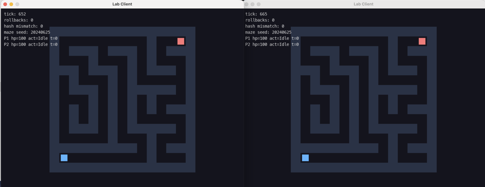

# Fighting：可复现的权威同步对战 Demo

C++20、SDL2、libevent，固定 60Hz。每个房间容纳两名玩家；客户端本地预测，服务端裁决，权威快照驱动恢复重放。当前在线协议为 **v6**，客户端和服务端必须一起升级，在线入口拒绝 v5。

[源码阅读与同步时序](docs/ARCHITECTURE.md) · [设计、检查记录与后续方向](docs/PROJECT_DESIGN.md) · [升级验证及同版本性能对照](docs/UPGRADE_REPORT.md)



## 构建与回归

依赖：CMake、C++20 编译器、nlohmann-json、libevent；窗口客户端另需 SDL2 和 SDL2_ttf。没有新增生产依赖。已有 presets 使用本机 Apple Silicon 与 `/Volumes/chutian/opt/...` 路径，换机器请调整工具和架构。

```bash
cmake --preset vcpkg-debug
cmake --build --preset build-debug
ctest --preset test-debug --timeout 120

cmake --preset vcpkg-release
cmake --build --preset build-release
ctest --preset test-release --timeout 120
```

依赖已安装、环境限制工作区外写入时，可在配置命令增加 `-DVCPKG_MANIFEST_INSTALL=OFF`，构建前设置 `CCACHE_DISABLE=1`。测试 presets 排除历史 `performance` 标签；包含同步核心、回放、真实 UDP 房间测试和网络/容量冒烟。UDP 测试需要允许本地绑定与收发。

无 SDL 构建：

```bash
cmake --preset vcpkg-debug -B build/headless \
  -DLAB_BUILD_CLIENT=OFF -DLAB_BUILD_PERFORMANCE=OFF
cmake --build build/headless
ctest --test-dir build/headless --output-on-failure
```

## 对战、房间和录制

先启动服务器，再分别启动两个客户端。不同房间独立运行，默认房间 1、最多 64 个房间。

```bash
./build/vcpkg-debug/lab_server --port 40000 --max-rooms 64 --record-dir build/replays
./build/vcpkg-debug/lab_client --server 127.0.0.1:40000 --room 1
./build/vcpkg-debug/lab_client --server 127.0.0.1:40000 --room 1 --record build/client.jsonl
```

`W/A/S/D` 或方向键移动，`Space` 射击，`F` 切换显示平滑，`Escape` 退出。也可用 `--no-smoothing` 做对照，`--font <字体路径>` 指定字体；macOS 默认 Menlo。

客户端一秒没有有效权威回复后重新握手。服务端保留席位十秒并继续推进原局，缺失输入最多保持六帧；凭证恢复原槽位，新连接代次使旧报文失效。超过宽限期结束旧局；服务端重启建立新身份。空房间三十秒后回收。

服务端录制为每局一个 JSON Lines 文件，保留实际采用的逐帧输入。客户端 `--record` 请求原始权威记录，累计确认后重发遗漏帧；重新握手会生成独立 `.segmentN` 文件，避免把不同恢复起点拼成伪回放。正常退出写入文件尾；缺失文件尾视为截断。

## 网络实验

```bash
./build/vcpkg-release/lab_network_lab --matrix --seed 42 --json build/matrix.json
./build/vcpkg-release/lab_network_lab --rtt 100 --loss 0.05 --jitter 20 \
  --reorder 0.02 --duplicate 0.01 --seed 42 --trace build/trace.json
./build/vcpkg-release/lab_network_lab --replay-trace build/trace.json
```

标准矩阵：RTT 50/100/150ms × 丢包 0/1/5%，双向抖动 ±20ms、乱序 2%、重复 1%；每场 3000 tick，随后恢复正常网络观察一秒。可用 `--up-delay` / `--down-delay` 分别设置单向延迟，`--ticks` 调整时长。JSON 包含校正、同帧误差分位数、重放、重同步/重连、包数和字节数。失败自动保存配置、输入和完整数据报轨迹。

虚拟时间、身份随机源和网络种子保证事件与功能统计可重复；实测重放耗时不参与一致性判断。真实 UDP 的操作系统调度另行测试。

## 回放与首差异定位

```bash
./build/vcpkg-debug/lab_replay build/replays/<录制文件>.jsonl
./build/vcpkg-debug/lab_client --replay build/replays/<录制文件>.jsonl
```

窗口中 `Space` 播放/暂停，暂停时 `→` 前进一帧，`1/2/3` 切换 0.5×/1×/2×，`R` 从头开始。首次分叉停止自动播放，显示帧号、字段、期望值和实际值；无界面校验返回失败退出码。首版支持顺序播放，不支持任意跳转。

## 容量与性能

```bash
./build/vcpkg-release/lab_udp_bots --mode udp --rooms 16 \
  --warmup 5 --sample 30 --repeat 3 --json build/udp16.json
python3 tools/run_v6_benchmark.py --binary build/vcpkg-release/lab_udp_bots \
  --output build/v6-performance/current
```

`--mode core` 测量无系统调用的完整同步流程，`--mode udp` 使用真实 loopback socket 与生产 `ServerRuntime`。报告包含实际输入吞吐、ACK RTT、tick P99、deadline miss、分配次数、峰值 RSS、编码字节和带宽。两种容量口径分开报告；实时预算为 P99 ≤16.67ms、deadline miss ≤0.1%。

历史 [压力报告](docs/STRESS_TEST_REPORT.md)、[性能报告](docs/PERFORMANCE_REPORT.md) 和 [原始数据](docs/performance_results.json) 保留作 v5 背景，不证明 v6 优化收益。旧教学 `RecordReplay` / `FixedTimestepRunner`、旧编解码和历史基准仅进入 `lab_teaching` 测试库；生产入口链接 v6 核心。

当前验收面向 macOS；没有公网认证、账号、匹配、部署或跨平台浮点完全确定性的承诺。全量快照和 JSON 诊断载荷便于检查，带宽优化需依据新报告再决定。
