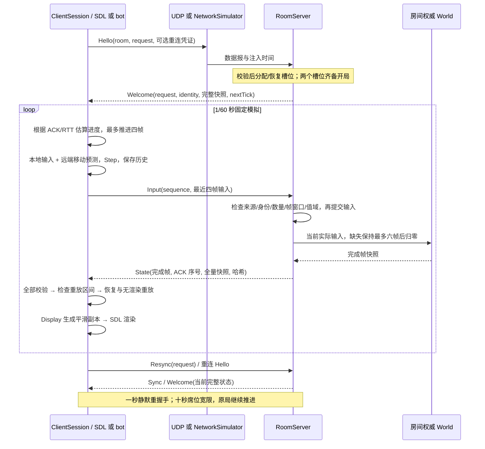

# 架构与源码阅读指南

在线路径是“输入 → 本地预测 → 数据报 → 权威推进 → 快照校验 → 恢复重放 → 独立显示状态”。客户端、虚拟实验与真实 UDP bot 使用同一个 `ClientSession`，所有权威房间使用同一个 `RoomServer`，模拟只调用 `World::Step`。

## 源码阅读顺序与模块职责

| 顺序 | 源码 | 核心问题 |
| --- | --- | --- |
| 1 | [InputCmd](../include/lab/sim/InputCmd.h)、[WorldSnapshot](../include/lab/sim/StateSnapshot.h) | 输入是意图；快照是已完成帧状态 |
| 2 | [World](../src/sim/World.cpp)、[Hasher](../src/sim/Hasher.cpp) | 移动、射击、四轮墙体约束推箱；保存/恢复全部模拟字段；毫米哈希 |
| 3 | [InputBuffer](../src/sim/InputBuffer.cpp)、[StateHistory](../include/lab/sim/StateHistory.h) | 完整帧号防止环槽覆盖误读；静态地图与动态历史 |
| 4 | [Protocol](../include/lab/session/Protocol.h)、[编解码实现](../src/session/Protocol.cpp) | v6 身份、控制请求、严格边界及先校验后提交 |
| 5 | [RoomServer](../src/session/RoomServer.cpp) | 房间路由、席位、输入保持、开局、重连与到期 |
| 6 | [ClientSession](../src/session/ClientSession.cpp) | `Update` 调度预测；`HandleDatagram` 分发；`AcceptWelcome` 初始化；`AcceptAuthoritativeSnapshot` 校验校正；`RestoreAndReplay` 恢复重放；`Display` 平滑 |
| 7 | [ServerRuntime](../src/session/ServerRuntime.cpp)、[UdpSocket](../src/net/UdpSocket.cpp)、[两个入口](../apps) | 注入时钟的核心与真实收发适配；资源所有权 |
| 8 | [NetworkSimulator](../src/session/NetworkSimulator.cpp)、[实验器](../apps/network_lab_main.cpp) | 数据报排队、固定事件编号、双向扰动、轨迹重演 |
| 9 | [Replay](../src/session/Replay.cpp)、[回放工具](../apps/replay_main.cpp)、[测试](../tests) | 原始浮点初值、实际采用输入、固定字段顺序首差异 |

`ClientSession` 不引用 SDL、socket 或真实调度时钟，接受输入、字节串、来源校验结果和注入时间。`steady_clock` 仅测量重放成本，不影响模拟决策。应用验证来源地址，核心验证身份、长度、值域、地图和哈希；无效包只增加拒绝统计。

### 在线主链路与离线教学辅助

生产 `lab_core` 包含 `session`、`sim`、UDP 和时钟。`lab_teaching` 仅在测试构建中包含旧 `AuthoritativeServer`、旧编解码、`NetStub`、内存 `RecordReplay` 和 `FixedTimestepRunner`，供原有教学测试与历史性能工具使用。生产服务器和客户端没有旧协议接收分支。

`World::Step` 修改内部状态，确定性依赖相同初值、输入、步长和兼容浮点环境。网络哈希按毫米量化，回放则比较原始字段，不能以毫米哈希代替跨平台浮点验证。

## 一局比赛的通信脉络



## v6 协议与身份

包头是大端 `magic(4) + version(2) + type(2) + bodyLength(4)`，后接 UTF-8 JSON，最长 16384 字节。JSON 使用现有依赖，限制嵌套深度、实体/输入数量、地图尺寸和所有模拟字段值域；长度必须完全相符，超限报错，不截断编码。

| 报文 | 方向 | 含义 |
| --- | --- | --- |
| Hello / Welcome | 双向控制 | 房间、关联请求号、重连凭证；回复携带完整地图、动态状态和下一输入帧 |
| Input | 客户端 → 服务端 | 独立序号、最近四帧本地输入，以及录制帧确认 |
| State | 服务端 → 客户端 | 权威完成帧、累计输入序号 ACK、全量量化快照；默认每两帧发送 |
| Resync / Sync | 双向控制 | 关联请求号，提供当前完整恢复点 |
| Reject | 服务端 → 客户端 | 明确的满房、房间数超限、凭证过期、实例重启等原因 |
| End | 服务端 → 客户端 | 席位宽限到期，终止旧比赛；剩余玩家保留自身凭证回到等待态 |

身份由 `instance + room + match + session + generation + player` 构成，另有重连 token。实例随机身份隔离服务端重启；比赛和连接代次隔离旧局、旧连接。控制请求使用 request 关联，重复 Hello 保持身份和代次；新的凭证握手允许地址变化并递增代次。玩法包还必须来自当前保存的地址。计数与帧比较使用模 2³² 的差值，比较范围必须小于半个编号空间。

控制包的 request 表示同一次逻辑请求，sequence 标识每次发送并在回复中回显，用于取得初始 RTT。发送时间保存在独立的有限环形槽中，读取检查完整序号；重新握手清理旧代次输入时间戳，避免把旧 ACK 当作当前延迟。

重新握手和重同步每 250ms 重试。服务端从最后合法活动起保留十秒，期间模拟继续运行；超过宽限结束该局。空房间三十秒回收；默认上限 64。房间各自保存世界、输入、席位、比赛和记录，互不修改。

## 固定时间步与 tick 含义

初始化快照表示完成帧 **0**；首个输入是 **1**。任意完整快照的 `nextTick = snapshot.tick + 1`。没有旧版首帧偏移或隐含倒计时。

服务端定时器约 1ms 唤醒，真实时间累积后每次 `Step` 使用 1/60 秒；每次回调最多追四帧，剩余时间留待下一回调。累计 40ms 时推进两帧并保留约 6.67ms。客户端根据权威进度调度，不改变模拟步长。

目标领先帧为 `ceil((RTT/2 + jitterMargin) / step) + 2`，限制 2–10；`jitterMargin = (P95 - P50) / 2`，取最近 64 个 RTT 样本。权威接收点加半个 RTT 和单调时钟推算当前进度；超前暂停、落后最多四帧补进。超出恢复预算进入重同步。

## 本地预测、历史与恢复重放

本地历史保存实际输入；远端没有真实按键，只从权威速度推测移动，硬直时归零，不预测远端射击。服务端实际采用输入独立记录，不能用本地远端猜测代替。

收到完成帧 100，而本地下一输入帧是 104：

```text
完整校验 auth[100]
确认本地输入 101、102、103 全部存在，且数量不超过 120
Restore(auth[100])
Step(input[101]) → Step(input[102]) → Step(input[103])
下一输入仍为 104
```

重放区间严格是 `auth.tick + 1 .. localNextTick - 1`。每个有效新快照都恢复重放，误差计数阈值只影响统计。历史缺失或重放超过 120 帧时停止预测并请求完整状态，不填空输入；有效未来快照直接将下一帧推进至其完成帧加一。

环槽索引为 `tick % capacity`，读取必须检查完整 tick。容量四写入帧八后，不能把覆盖后的槽位当帧四。历史只保存动态状态，共享每局只读地图；导出完整值快照仍包含地图，内部视图用于无需复制的读取，使用期限至该槽位被覆盖。

## 哈希、恢复状态与显示

位置/速度用 `lround(value * 1000)` 量化；v6 JSON 快照携带毫米粒度的米值，解码重新按同一口径哈希。Hasher 保留固定字段顺序，包含帧号、所有玩家/弹道字段、地图元数据和每个网格；没有用地图摘要替换网格。1.23456m → 1235mm → 1.235m 应得到同一量化哈希。哈希用于诊断，不是报文认证。

恢复必须包含位置、速度、HP、动作、硬直、冷却、瞄准、弹道及地图。`World::Restore` 重建射击方向和弹道内部缓存。地图由服务端下发，避免不同标准库的地图生成细节影响对局。

`Display` 输出世界副本。本地校正偏移在 100ms 内线性消除，超过 2m 或重同步直接采用新位置；远端位置按 100ms 延迟在权威快照间插值，样本不足保持最近状态。HP、动作和命中结果离散取样；平滑不参与碰撞、哈希或回放，`F` 可切换对照。

## 回放与网络轨迹

回放 JSON Lines 首行包含格式/协议/模拟版本、步长、身份、**原始浮点**初始快照和完整地图。每帧保存权威实际应用输入、原始动态快照和哈希；地图只保存于文件头。结束记录用于检测截断。浮点写入使用可往返表示；不能把毫米网络状态当成回放初值。

客户端请求录制时，Welcome 额外传原始初值；State 携带至多两条待确认原始帧记录，服务端保留 240 帧记录供重发。重新握手开启新录制段。客户端持续累计确认，重复记录不再写入。重放逐字段比较，首次差异停止自动播放。窗口动作委托给可测试的 `ReplayPlayback`，暂停期间时间不会累积为隐含追帧。

网络轨迹保存配置、本地输入、原始数据报、发送/投递时间、丢弃标志和稳定事件编号。相同种子重新运行实际两端核心，逐事件比较，再比较去除实测耗时的功能统计。虚拟实验器以 60Hz 调用两端与投递队列；配置延迟是数据报传播延迟，观测 RTT 还包含轮询等待，不能把配置值当作精确观测值。真实 UDP 容量由 `ServerRuntime` 与 socket bot 测量，不声称内核调度可复现。
